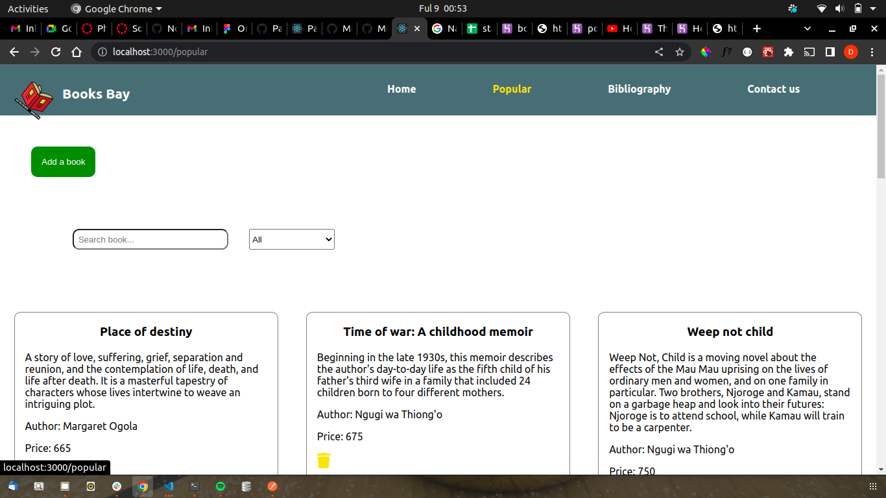

# VIRTUAL BOOKSTORE TEST

This is an online bookstore specifically for Kenyan novelists. The app uses Sinatra to display books on the react application.The app uses react for it's front-end and ruby for the back-end.

#### By **Denis** created on, 8th September 2022

## Screenshot
   


## Table of Content

- [Description](#description)
- [Design](#design)
- [Behavior of the website](#siteBehavior)
- [Development and set up](#setUp)
- [Prerequisites](#Prerequisites)
- [Live link](#Live-Link)
- [Technology Used](#technology-Used)
- [Licence](#licence)
- [Authors Info](#Authors-info)

## Description

This is a website showing books available at an online store written by the best kenyan authors. The app also has a bibliography section showing information about the authors and some of the books they have written.

## Design
https://www.figma.com/file/FidQxrcOtPnvMmzxxJlRge/Online-Bookstore?node-id=0%3A1

## Behaviour of the website
### View
+ The website is visually appealing
+ The website has 4 pages a home page, a popular books page, bibliography and a contact us/feedback page
+ Clicking on the delete icon deletes a book from the page
+ Submitting a new book instance appends it on the books list
+ Submitting a new author adds it on the authors list
+ Submitting a message delivers the feedback to the admin


## Development and Setup.

### prerequisites
+ First clone the project to your computer. ```git clone <repo url>```
+ Ensure you have text editor such as Vs code installed.
+ Extract the files and open them in the editor.
+ Run npm install to install dependencies.
+ Run npm start to run the react application


### Live Link
* The live link for the project is 

## Technology and Tools Used

+ HTML5
+ CSS5
+ JavaScript
+ Node js
- Git - Version control
- Vs code- Code editor


## Licence
MIT License

Copyright (c) [2022] [Denis Kariuki]

Permission is hereby granted, free of charge, to any person obtaining a copy
of this software and associated documentation files (the "Software"), to deal
in the Software without restriction, including without limitation the rights
to use, copy, modify, merge, publish, distribute, sublicense, and/or sell
copies of the Software, and to permit persons to whom the Software is
furnished to do so, subject to the following conditions:

The above copyright notice and this permission notice shall be included in all
copies or substantial portions of the Software.

THE SOFTWARE IS PROVIDED "AS IS", WITHOUT WARRANTY OF ANY KIND, EXPRESS OR
IMPLIED, INCLUDING BUT NOT LIMITED TO THE WARRANTIES OF MERCHANTABILITY,
FITNESS FOR A PARTICULAR PURPOSE AND NONINFRINGEMENT. IN NO EVENT SHALL THE
AUTHORS OR COPYRIGHT HOLDERS BE LIABLE FOR ANY CLAIM, DAMAGES OR OTHER
LIABILITY, WHETHER IN AN ACTION OF CONTRACT, TORT OR OTHERWISE, ARISING FROM,
OUT OF OR IN CONNECTION WITH THE SOFTWARE OR THE USE OR OTHER DEALINGS IN THE
SOFTWARE.

## Author's info
Linked in - [Denis Kariuki]
